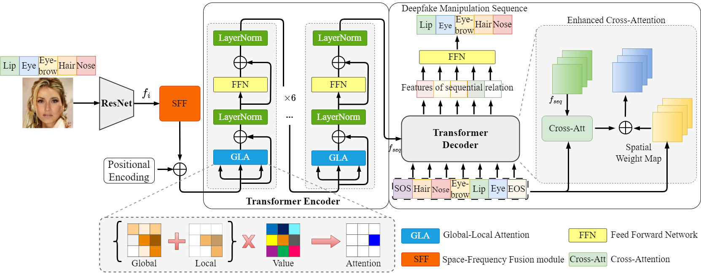
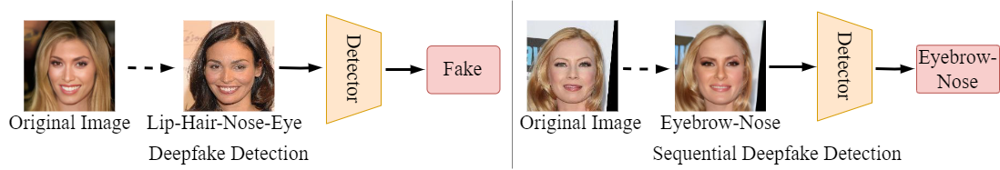

# Space-Frequency and Global-Local Attentive Networks for Sequential Deepfake Detection


## Introduction
The proliferation of deepfake systems has emerged as a significant challenge in the dynamic realm of digital media. It poses threats to information credibility, privacy, and security. Moreover, the accessibility of facial editing tools further enables users to alter facial features subtly through a series of intricate steps. To address the issue, we introduce a Space-Frequency and Global-Local Attentive Network~(SFGLA-Net) for sequential deepfake detection. This method is designed to identify and analyze the sophisticated manipulation features of deepfake images. Specifically, we introduce a space-frequency fusion module to leverage the spatial and frequency domains. This module can unearth subtle inconsistencies and artifacts not perceptible in the spatial domain alone. Additionally, a global-local attention module is employed to pinpoint the manipulated areas more accurately. Extensive experiments demonstrate the superior performance of the proposed method, significantly outperforming existing techniques in sequential deepfake detection.

The framework of the proposed method:

<div align="center">

</div>

## Deepfake Detection and Sequential Deepfake Detection 


<div align="center">

</div>


### Download
```
git clone git@github.com:guishengzhanga/SFGLA.git
cd SFGLA
```

## Results

#### Facial Components Manipulation
| Method            |  Fixed-Acc ${\uparrow}$ | Adaptive-Acc ${\uparrow}$
| ----------------- | :---:             | :---: 
| [DRN](https://arxiv.org/abs/1906.05856)               |  66.06            | 45.79 
| [Multi-Cls](https://arxiv.org/pdf/2207.02204.pdf)         | 69.65             | 50.57     
| [DETR](https://www.ecva.net/papers/eccv_2020/papers_ECCV/papers/123460205.pdf)              | 69.75             | 49.84     
| [MA](https://arxiv.org/abs/2103.02406)                | 71.31             | 52.94 
| [SeqFakeFormer](https://arxiv.org/pdf/2207.02204.pdf)      |  71.58            | 53.62 
|  SFGLA-Net (our)  |  **72.85**        | **55.70** 

#### Facial Attributes Manipulation
| Method            |  Fixed-Acc ${\uparrow}$ | Adaptive-Acc ${\uparrow}$
| ----------------- | :---:             | :---: 
| [DRN](https://arxiv.org/abs/1906.05856)              | 64.42             | 43.20 
| [Multi-Cls](https://arxiv.org/pdf/2207.02204.pdf)         | 66.66             | 46.00     
| [DETR](https://www.ecva.net/papers/eccv_2020/papers_ECCV/papers/123460205.pdf)              | 67.62             | 47.99     
| [MA](https://arxiv.org/abs/2103.02406)                | 67.58             | 47.48 
| [SeqFakeFormer](https://arxiv.org/pdf/2207.02204.pdf)     | 68.12             | 48.58 
|  SFGLA-Net (our)  |  **68.94**        | **49.74** 

## Citation
If you find this work useful for your research, please kindly cite our paper:
```
@inproceedings{zhang2024space,
  title={Space-Frequency and Global-Local Attentive Networks for Sequential Deepfake Detection},
  author={Guisheng, Zhang and Qilei, Li and Mingliang, Gao and Siyou, Guo and Gwanggil, Jeon and Ahmed, M. Abdelmoniem},
  journal={under_review},
  year={2024},
}

```
# Acknowledgements
 
 Thanks to the code available at https://github.com/rshaojimmy/SeqDeepFake.

[//]: <## Acknowledgements>